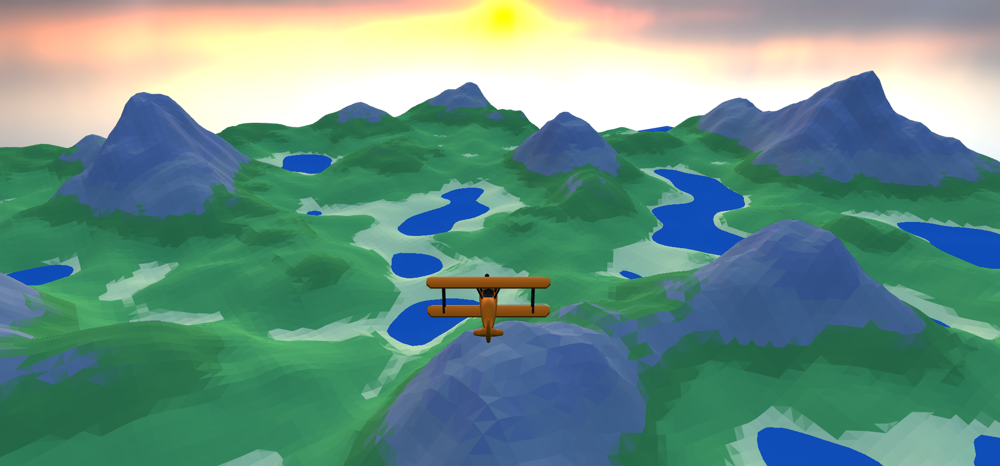

### Flight over an infinite landscape



Simple demo of procedural generation in THREE.js.

It implements perlin noise as described in https://adrianb.io/2014/08/09/perlinnoise.html. \
The noise is used by Marching Cubes Algorithm to generate chunks of geometry.\
The generation is run in separate thread using Web Workers API in order to avoid frame drops. \
Invisible chunks get deleted to free up memory.

Running the demo:
```shell
npm install       # install the dependencies
npm run build     # run vite build
npm run preview   # run the demo
```

Use WASD to steer the plane.